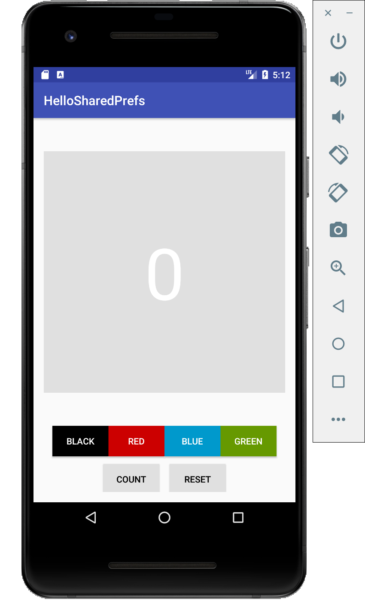
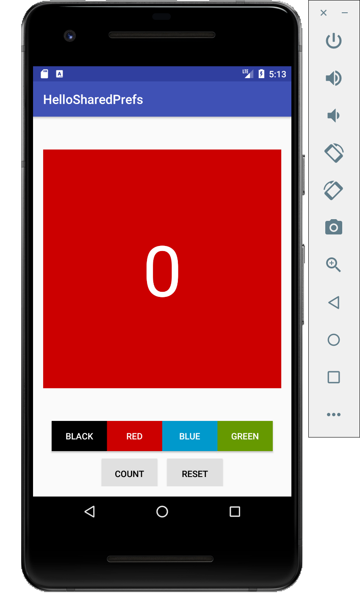
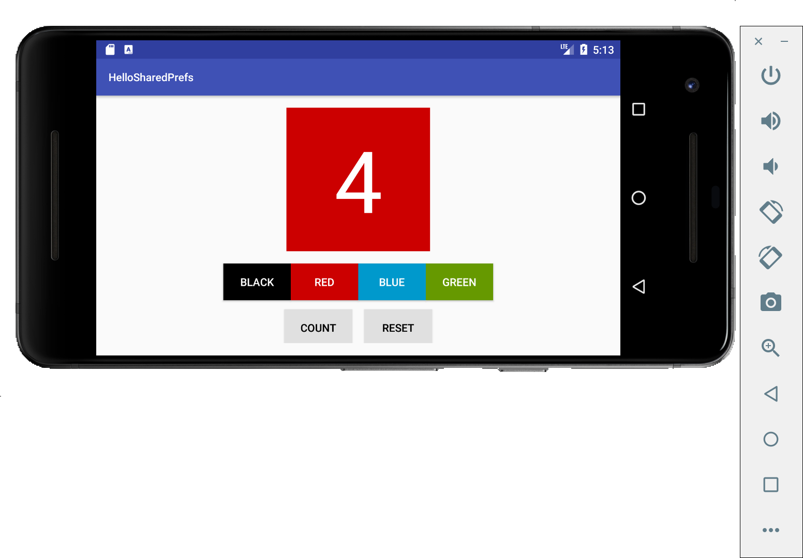

# Lab11 Practice: HelloSharedPrefs

- [Lab11 Practice: HelloSharedPrefs](#lab11-practice-hellosharedprefs)
  - [ScreenCut](#screencut)
  - [Video](#video)
  - [Code](#code)
    - [`MainActivity.java`](#mainactivityjava)
    - [`activity_main.xml`](#activity_mainxml)

## ScreenCut

1. Layout



2. Set color



3. count up


4. Horizontal Layout



## Video

[Video Link](./lab11_practice.mov)

## Code

### `MainActivity.java`

```java
/*
 * Copyright (C) 2016 Google Inc.
 *
 * Licensed under the Apache License, Version 2.0 (the "License");
 * you may not use this file except in compliance with the License.
 * You may obtain a copy of the License at
 *
 *      http://www.apache.org/licenses/LICENSE-2.0
 *
 * Unless required by applicable law or agreed to in writing, software
 * distributed under the License is distributed on an "AS IS" BASIS,
 * WITHOUT WARRANTIES OR CONDITIONS OF ANY KIND, either express or implied.
 * See the License for the specific language governing permissions and
 * limitations under the License.
 */
package com.example.android.hellosharedprefs;

import android.content.SharedPreferences;
import android.graphics.drawable.ColorDrawable;
import android.support.v4.content.ContextCompat;
import android.support.v7.app.AppCompatActivity;
import android.os.Bundle;
import android.view.View;
import android.widget.TextView;

/**
 * HelloSharedPrefs is an adaptation of the HelloToast app from chapter 1.
 * It includes:
 * - Buttons for changing the background color.
 * - Maintenance of instance state.
 * - Themes and styles.
 * - Read and write shared preferences for the current count and the color.
 * <p>
 * This is the starter code for HelloSharedPrefs.
 */
public class MainActivity extends AppCompatActivity {
    // Current count
    private int mCount = 0;
    // Current background color
    private int mColor;
    // Text view to display both count and color
    private TextView mShowCountTextView;

    // Key for current count
    private final String COUNT_KEY = "count";
    // Key for current color
    private final String COLOR_KEY = "color";

    private SharedPreferences mPreferences;
    private String sharedPrefFile = "com.example.android.hellosharedprefs";


    @Override
    protected void onCreate(Bundle savedInstanceState) {
        super.onCreate(savedInstanceState);
        setContentView(R.layout.activity_main);

        // Initialize views, color
        mShowCountTextView = findViewById(R.id.count_textview);
        mColor = ContextCompat.getColor(this,
                R.color.default_background);

        mPreferences = getSharedPreferences(sharedPrefFile, MODE_PRIVATE);

        mCount = mPreferences.getInt(COUNT_KEY, 0);
        mShowCountTextView.setText(String.format("%s", mCount));
        mColor = mPreferences.getInt(COLOR_KEY, mColor);
        mShowCountTextView.setBackgroundColor(mColor);

        // Restore the saved instance state.
//        if (savedInstanceState != null) {
//
//            mCount = savedInstanceState.getInt(COUNT_KEY);
//            if (mCount != 0) {
//                mShowCountTextView.setText(String.format("%s", mCount));
//            }
//
//            mColor = savedInstanceState.getInt(COLOR_KEY);
//            mShowCountTextView.setBackgroundColor(mColor);
//        }
    }

    /**
     * Handles the onClick for the background color buttons. Gets background
     * color of the button that was clicked, and sets the TextView background
     * to that color.
     *
     * @param view The view (Button) that was clicked.
     */
    public void changeBackground(View view) {
        int color = ((ColorDrawable) view.getBackground()).getColor();
        mShowCountTextView.setBackgroundColor(color);
        mColor = color;
    }

    /**
     * Handles the onClick for the Count button. Increments the value of the
     * mCount global and updates the TextView.
     *
     * @param view The view (Button) that was clicked.
     */
    public void countUp(View view) {
        mCount++;
        mShowCountTextView.setText(String.format("%s", mCount));
    }

//    /**
//     * Saves the instance state if the activity is restarted (for example,
//     * on device rotation.) Here you save the values for the count and the
//     * background color.
//     *
//     * @param outState The state data.
//     */
//    @Override
//    protected void onSaveInstanceState(Bundle outState) {
//        super.onSaveInstanceState(outState);
//
//        outState.putInt(COUNT_KEY, mCount);
//        outState.putInt(COLOR_KEY, mColor);
//    }

    /**
     * Handles the onClick for the Reset button. Resets the global count and
     * background variables to the defaults and resets the views to those
     * default values.
     *
     * @param view The view (Button) that was clicked.
     */
    public void reset(View view) {
        // Reset count
        mCount = 0;
        mShowCountTextView.setText(String.format("%s", mCount));

        // Reset color
        mColor = ContextCompat.getColor(this,
                R.color.default_background);
        mShowCountTextView.setBackgroundColor(mColor);

        SharedPreferences.Editor preferencesEditor = mPreferences.edit();
        preferencesEditor.clear();
        preferencesEditor.apply();
    }

    @Override
    protected void onPause(){
        super.onPause();

        SharedPreferences.Editor preferencesEditor = mPreferences.edit();
        preferencesEditor.putInt(COUNT_KEY, mCount);
        preferencesEditor.putInt(COLOR_KEY, mColor);
        preferencesEditor.apply();
    }
}
```

### `activity_main.xml`

```xml
<?xml version="1.0" encoding="utf-8"?>
<!--
  Copyright (C) 2018 Google Inc.

  Licensed under the Apache License, Version 2.0 (the "License");
  you may not use this file except in compliance with the License.
  You may obtain a copy of the License at

      http://www.apache.org/licenses/LICENSE-2.0

  Unless required by applicable law or agreed to in writing, software
  distributed under the License is distributed on an "AS IS" BASIS,
  WITHOUT WARRANTIES OR CONDITIONS OF ANY KIND, either express or implied.
  See the License for the specific language governing permissions and
  limitations under the License.
  -->
<android.support.constraint.ConstraintLayout
    xmlns:android="http://schemas.android.com/apk/res/android"
    xmlns:app="http://schemas.android.com/apk/res-auto"
    xmlns:tools="http://schemas.android.com/tools"
    android:layout_width="match_parent"
    android:layout_height="match_parent"
    android:padding="16dp"
    tools:context=".MainActivity">

    <TextView
        android:id="@+id/count_textview"
        android:layout_width="0dp"
        android:layout_height="0dp"
        android:background="@color/default_background"
        android:gravity="center"
        android:text="@string/default_count"
        android:textColor="@android:color/white"
        android:textSize="112sp"
        app:layout_constraintBottom_toTopOf="@+id/guideline_upper"
        app:layout_constraintDimensionRatio="1:1"
        app:layout_constraintEnd_toEndOf="parent"
        app:layout_constraintStart_toStartOf="parent"
        app:layout_constraintTop_toTopOf="parent"/>

    <android.support.constraint.Guideline
        android:id="@+id/guideline_upper"
        android:layout_width="wrap_content"
        android:layout_height="wrap_content"
        android:orientation="horizontal"
        app:layout_constraintGuide_end="120dp"/>

    <Button
        android:id="@+id/black_background_button"
        style="@style/AppTheme.Button.Colored"
        android:layout_width="wrap_content"
        android:layout_height="wrap_content"
        android:background="@android:color/black"
        android:onClick="changeBackground"
        android:text="@string/black_button"
        app:layout_constraintBottom_toTopOf="@+id/guideline_lower"
        app:layout_constraintEnd_toStartOf="@+id/red_background_button"
        app:layout_constraintHorizontal_chainStyle="packed"
        app:layout_constraintStart_toStartOf="parent"
        app:layout_constraintTop_toTopOf="@+id/guideline_upper"/>

    <Button
        android:id="@+id/red_background_button"
        style="@style/AppTheme.Button.Colored"
        android:layout_width="wrap_content"
        android:layout_height="wrap_content"
        android:background="@color/red_background"
        android:onClick="changeBackground"
        android:text="@string/red_button"
        app:layout_constraintBottom_toTopOf="@+id/guideline_lower"
        app:layout_constraintEnd_toStartOf="@+id/blue_background_button"
        app:layout_constraintStart_toEndOf="@+id/black_background_button"
        app:layout_constraintTop_toTopOf="@+id/guideline_upper"/>

    <Button
        android:id="@+id/blue_background_button"
        style="@style/AppTheme.Button.Colored"
        android:layout_width="wrap_content"
        android:layout_height="wrap_content"
        android:background="@color/blue_background"
        android:onClick="changeBackground"
        android:text="@string/blue_button"
        app:layout_constraintBottom_toTopOf="@+id/guideline_lower"
        app:layout_constraintEnd_toStartOf="@+id/green_background_button"
        app:layout_constraintStart_toEndOf="@+id/red_background_button"
        app:layout_constraintTop_toTopOf="@+id/guideline_upper"/>

    <Button
        android:id="@+id/green_background_button"
        style="@style/AppTheme.Button.Colored"
        android:layout_width="wrap_content"
        android:layout_height="wrap_content"
        android:background="@color/green_background"
        android:onClick="changeBackground"
        android:text="@string/green_button"
        app:layout_constraintBottom_toTopOf="@+id/guideline_lower"
        app:layout_constraintEnd_toEndOf="parent"
        app:layout_constraintStart_toEndOf="@+id/blue_background_button"
        app:layout_constraintTop_toTopOf="@+id/guideline_upper"/>

    <android.support.constraint.Guideline
        android:id="@+id/guideline_lower"
        android:layout_width="wrap_content"
        android:layout_height="wrap_content"
        android:orientation="horizontal"
        app:layout_constraintGuide_end="56dp"/>

    <Button
        android:id="@+id/count_button"
        style="@style/AppTheme.Button"
        android:layout_width="wrap_content"
        android:layout_height="wrap_content"
        android:layout_marginEnd="16dp"
        android:layout_marginRight="16dp"
        android:onClick="countUp"
        android:text="@string/count_button"
        app:layout_constraintBottom_toBottomOf="parent"
        app:layout_constraintEnd_toStartOf="@+id/reset_button"
        app:layout_constraintHorizontal_chainStyle="packed"
        app:layout_constraintStart_toStartOf="parent"
        app:layout_constraintTop_toBottomOf="@+id/guideline_lower"/>

    <Button
        android:id="@+id/reset_button"
        style="@style/AppTheme.Button"
        android:layout_width="wrap_content"
        android:layout_height="wrap_content"
        android:onClick="reset"
        android:text="@string/reset_button"
        app:layout_constraintBottom_toBottomOf="parent"
        app:layout_constraintEnd_toEndOf="parent"
        app:layout_constraintStart_toEndOf="@+id/count_button"
        app:layout_constraintTop_toBottomOf="@+id/guideline_lower"/>

</android.support.constraint.ConstraintLayout>
```

