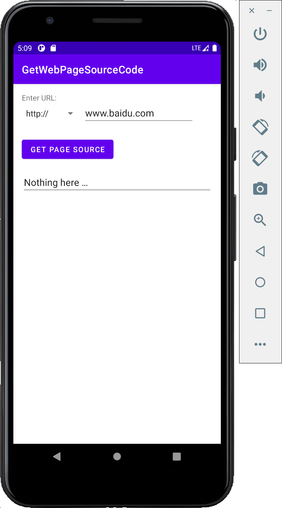
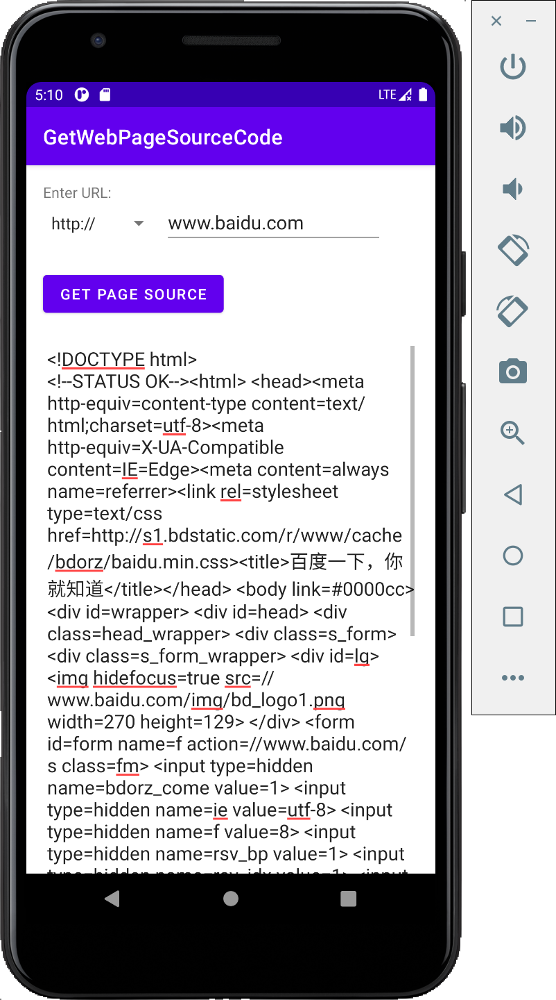

# Lab 9 Homework. Get Web Page Source Code

- [Lab 9 Homework. Get Web Page Source Code](#lab-9-homework-get-web-page-source-code)
  - [ScreenCut](#screencut)
  - [Video](#video)
  - [Code](#code)
    - [`MainActivity.java`](#mainactivityjava)
    - [`FetchSource.java`](#fetchsourcejava)
    - [`NetWorkUtils.java`](#networkutilsjava)

## ScreenCut

1. Layout



2. Get Page Source



## Video

[Video Link](./lab9_homework.mov)

## Code

> [code link](./GetWebPageSourceCode)

### `MainActivity.java`

```java
package com.example.getwebpagesourcecode;

import androidx.appcompat.app.AppCompatActivity;

import android.content.Context;
import android.net.ConnectivityManager;
import android.net.NetworkInfo;
import android.os.Bundle;
import android.view.View;
import android.view.inputmethod.InputMethodManager;
import android.widget.AdapterView;
import android.widget.ArrayAdapter;
import android.widget.EditText;
import android.widget.Spinner;

public class MainActivity extends AppCompatActivity implements
        AdapterView.OnItemSelectedListener {

    private String prefix = "http://";
    private EditText mWebLocation;
    private EditText mScrollTextView;

    @Override
    protected void onCreate(Bundle savedInstanceState) {
        super.onCreate(savedInstanceState);
        setContentView(R.layout.activity_main);

        mWebLocation = (EditText) findViewById(R.id.web_location_text);
        mScrollTextView = (EditText) findViewById(R.id.scroll_edittext);

        // Spinner
        Spinner spinner = (Spinner) findViewById(R.id.http_spinner);
        if (spinner != null) {
            spinner.setOnItemSelectedListener(this);
        }
        ArrayAdapter<CharSequence> adapter = ArrayAdapter.createFromResource(this,
                R.array.http_or_https, android.R.layout.simple_spinner_item);
        adapter.setDropDownViewResource
                (android.R.layout.simple_spinner_dropdown_item);
        if (spinner != null) {
            spinner.setAdapter(adapter);
        }
    }

    private String getWebString() {
        return prefix + mWebLocation.getText().toString();
    }

    @Override
    public void onItemSelected(AdapterView<?> parent, View view, int position, long id) {
        prefix = parent.getItemAtPosition(position).toString();
    }

    @Override
    public void onNothingSelected(AdapterView<?> parent) {

    }

    public void getWebSource(View view) {
        String queryString = getWebString();
        ConnectivityManager connMgr = (ConnectivityManager)
                getSystemService(Context.CONNECTIVITY_SERVICE);

        InputMethodManager inputManager = (InputMethodManager)
                getSystemService(Context.INPUT_METHOD_SERVICE);
        if (inputManager != null ) {
            inputManager.hideSoftInputFromWindow(view.getWindowToken(),
                    InputMethodManager.HIDE_NOT_ALWAYS);
        }

        NetworkInfo networkInfo = null;
        if (connMgr != null) {
            networkInfo = connMgr.getActiveNetworkInfo();
        }

        if (networkInfo != null && networkInfo.isConnected()
                && queryString.length() != 0) {
            new FetchSource(mScrollTextView).execute(queryString);
            mScrollTextView.setText(R.string.loading);
        } else {
            mScrollTextView.setText(R.string.no_network);
        }
    }
}
```

### `FetchSource.java`

```java
package com.example.getwebpagesourcecode;

import android.os.AsyncTask;
import android.widget.EditText;

import java.lang.ref.WeakReference;

public class FetchSource extends AsyncTask<String, Void, String> {

    WeakReference<EditText> mScrollViewRef;

    FetchSource(EditText scrollView) {
        mScrollViewRef = new WeakReference<>(scrollView);
    }

    @Override
    protected String doInBackground(String... strings) {
        return NetWorkUtils.getWebSource(strings[0]);
    }

    @Override
    protected void onPostExecute(String s) {
        super.onPostExecute(s);
        mScrollViewRef.get().setText(s);
    }
}

```

### `NetWorkUtils.java`

```java
package com.example.getwebpagesourcecode;

import android.net.Uri;
import android.util.Log;

import java.io.BufferedReader;
import java.io.IOException;
import java.io.InputStream;
import java.io.InputStreamReader;
import java.net.HttpURLConnection;
import java.net.MalformedURLException;
import java.net.ProtocolException;
import java.net.URL;

public class NetWorkUtils {

    private static final String LOG_TAG =
            NetWorkUtils.class.getSimpleName();

    static String getWebSource(String web) {
        HttpURLConnection urlConnection = null;
        BufferedReader reader = null;
        String webSourceCode = "";

        try {
            Uri builtURI = Uri.parse(web);
            URL requestURL = new URL(builtURI.toString());
            urlConnection = (HttpURLConnection) requestURL.openConnection();
            urlConnection.setRequestMethod("GET");
            urlConnection.connect();

            // Get the InputStream.
            InputStream inputStream = urlConnection.getInputStream();

            // Create a buffered reader from that input stream.
            reader = new BufferedReader(new InputStreamReader(inputStream));
            StringBuilder builder = new StringBuilder();
            String line;
            while ((line = reader.readLine()) != null) {
                builder.append(line);
                // Since it's JSON, adding a newline isn't necessary (it won't
                // affect parsing) but it does make debugging a *lot* easier
                // if you print out the completed buffer for debugging.
                builder.append("\n");
            }
            if (builder.length() == 0) {
                // Stream was empty. No point in parsing.
                return null;
            }
            webSourceCode = builder.toString();
        } catch (IOException e) {
            webSourceCode = e.toString();
        } finally {
            if (urlConnection != null) {
                urlConnection.disconnect();
            }
            if (reader != null) {
                try {
                    reader.close();
                } catch (IOException e) {
                    e.printStackTrace();
                }
            }
        }
        Log.d(LOG_TAG, webSourceCode);
        return webSourceCode;
    }

}

```

