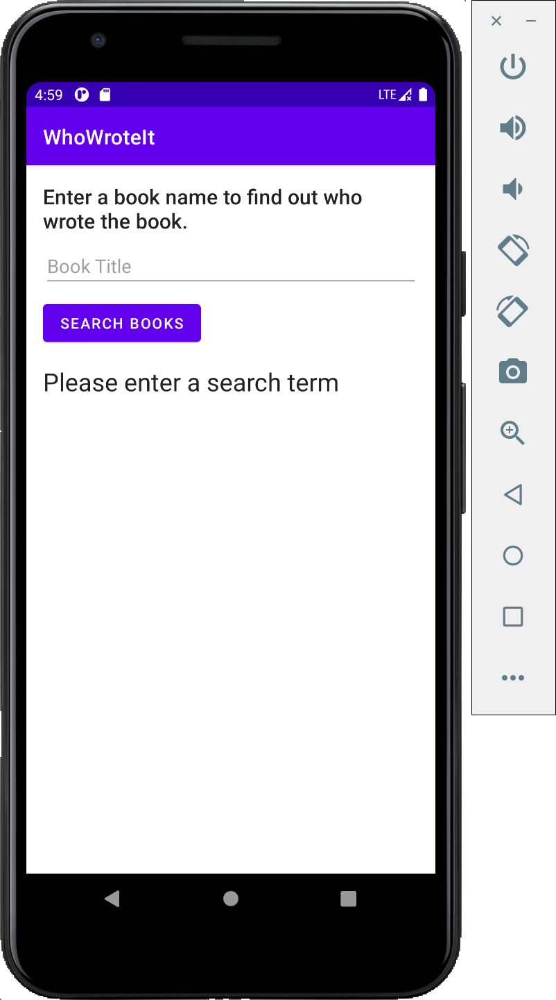
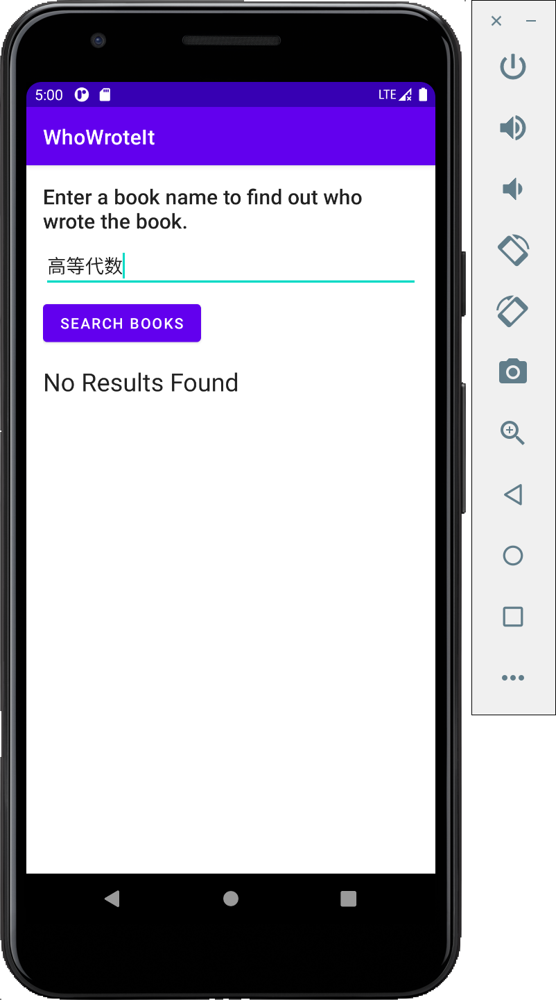

# Lab 9 Practice. Who wrote it?

> Thanks for the free api which I referenced from [csdn](https://blog.csdn.net/weixin_46291378/article/details/112320747)!
>
> the api is [https://sou.jiaston.com](https://sou.jiaston.com)

- [Lab 9 Practice. Who wrote it?](#lab-9-practice-who-wrote-it)
  - [ScreenCut](#screencut)
  - [Video](#video)
  - [Code](#code)

## ScreenCut

1. Layout

2. Search nothing

3. Search something

4. Search something which does not exist.

## Video

[Video Link](./lab9_practice.mov)

## Code

[Code Link](./WhoWroteIt)